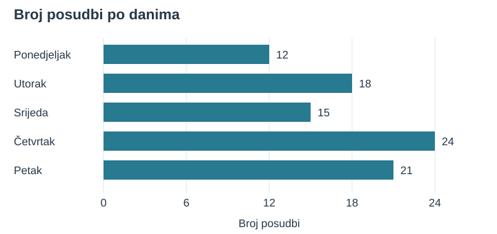
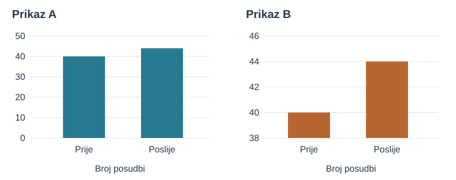
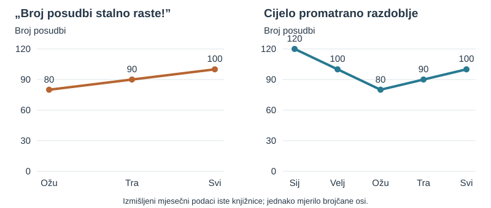
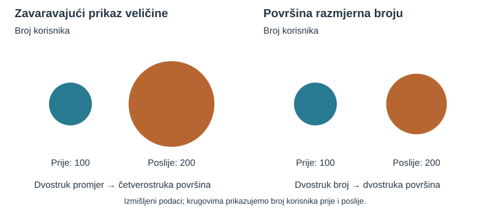
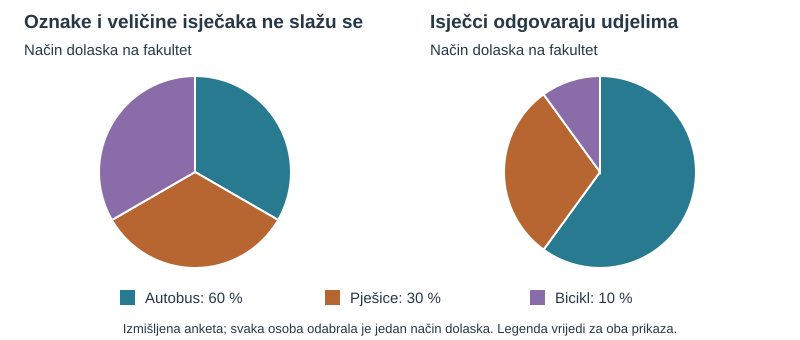
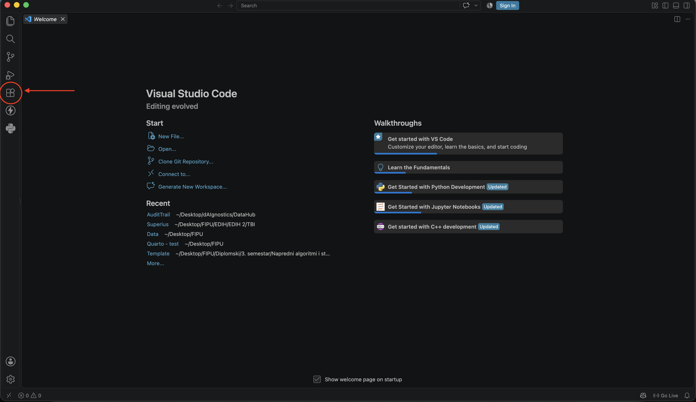
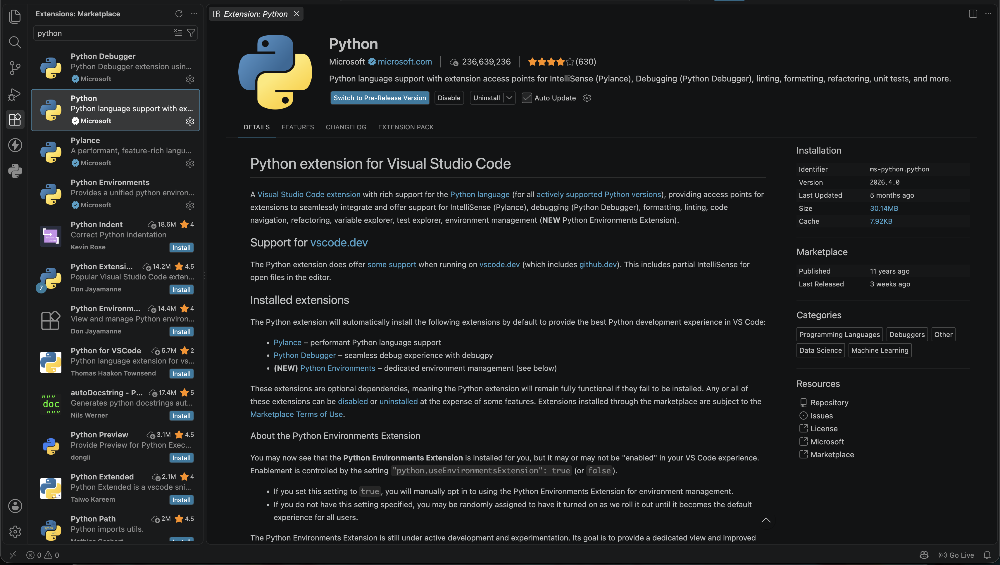
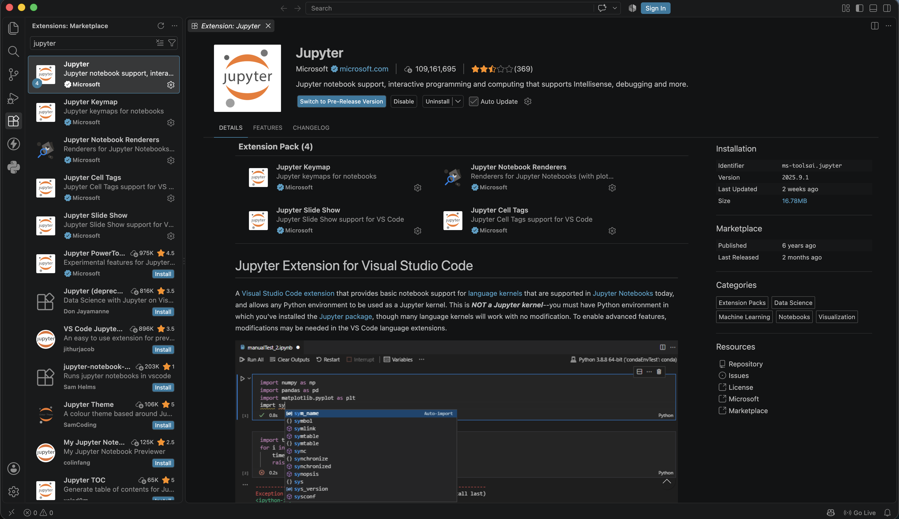

Vježba 0

Uvod u rad s podacima

<strong>Predavanja:</strong> doc. dr. sc. Ivan Lorencin

<strong>Vježbe:</strong> Elvis Starić mag. inf.

Na ovoj vježbi krenut ćemo od nekoliko neuređenih zapisa i od njih napraviti pregledan prikaz iz kojeg možemo izvesti zaključak. Pritom ćemo provjeriti koje informacije nedostaju, kako ih zapisati i kako način prikaza utječe na ono što čitatelj vidi. Nakon toga pripremit ćemo računalo i pokrenuti prve Python programe.

Skriptu možete pratiti tijekom nastave i ponovno proći samostalno. U vođenim primjerima najprije pokušajte napraviti opisani korak, a zatim pročitajte objašnjenje ili otvorite skriveni rezultat. Pred kraj skripte nalaze se teorijska pitanja i kratki Python zadaci, a odgovori i rješenja u posljednjem poglavlju.

# Od neuređenih zapisa do upotrebljivih podataka

Netko vam je poslao sljedeće zapise, bez naslova i dodatnog objašnjenja:

~~~text
pon 12
UTORAK: 18
sri - petnaest
čet 24
petak 21
~~~

**Znate li o čemu se radi? Možete li nešto zaključiti iz ovih zapisa?**

## Što znamo, a što samo pretpostavljamo?

Vidimo pet redaka, oznake koje upućuju na dane u tjednu i brojčane vrijednosti, od kojih je jedna zapisana riječju. Možemo usporediti brojeve i utvrditi da je 24 najveći. Međutim, još ne znamo što je toga dana bilo najviše, što se uopće broji ili mjeri, ni predstavljaju li svi brojevi istu veličinu.

Brojevi bi, primjerice, mogli predstavljati broj prodanih proizvoda, broj poziva ili izmjerenu temperaturu. Za svako od tih tumačenja isti bi zapis imao drukčije značenje. Možemo izračunati i zbroj brojeva, ali bez njihova značenja ne znamo bi li taj zbroj bio koristan odgovor na neko pitanje.

## Dodajmo kontekst

Sada dobivamo objašnjenje osobe koja je napravila zapise. 

Otkrij o čemu se radi

Zapisi se odnose na **jednu zamišljenu knjižnicu, pet uzastopnih radnih dana istog tjedna i broj posuđenih primjeraka knjiga tijekom cijelog dana**. Ako jedna osoba posudi tri knjige, u ovom primjeru brojimo tri posudbe. Svi podaci izmišljeni su za vježbu.

Želimo utvrditi **koliko je posudbi zabilježeno tijekom tih pet dana i kojeg je dana bilo najviše posudbi**.

Vratite se na početna tumačenjima. Što sada možete reći preciznije? Umjesto tvrdnje „24 je najveći broj” možemo reći „U četvrtak je zabilježeno najviše posudbi, njih 24”. Brojevi se nisu promijenili, ali sada znamo što predstavljaju i na koje pitanje njima želimo odgovoriti.

Time smo odredili i što brojimo. Broj posudbi nije nužno jednak broju posjetitelja: ista osoba može posuditi više knjiga ili doći bez posudbe. Kada bismo te veličine pomiješali, mogli bismo točno zbrojiti brojeve, a ipak dobiti pogrešan odgovor na pitanje o posjetiteljima.

::: {.callout-tip}
## Definicije: podatak, kontekst i informacija

**Podatak** je zabilježena vrijednost, činjenica, opažanje ili mjerenje. U našem primjeru `12` je podatak.

**Kontekst** je skup dodatnih informacija koje objašnjavaju na što se podatak odnosi: što se broji ili mjeri, gdje, kada i prema kojem pravilu. Ovdje znamo da `12` predstavlja broj posuđenih primjeraka knjiga u ponedjeljak.

**Informacija** je podatak ili skup podataka protumačen u odgovarajućem kontekstu. Rečenica „U ponedjeljak je u promatranoj knjižnici zabilježeno 12 posudbi” prenosi smisleno značenje zapisa.
:::

U stvarnom prikupljanju podataka zabilježili bismo i točne datume te naziv ili oznaku knjižnice. Kontekst ne bismo naknadno izmišljali: provjerili bismo ga s izvorom podataka. U ovom smo ga primjeru dobili naknadno kako bismo vidjeli koliko njegovo izostavljanje otežava tumačenje.

## Ujednačimo način zapisivanja

Sada znamo što podaci znače, ali njihov zapis još nije ujednačen. Dani su negdje skraćeni, a negdje napisani punim nazivom, izmjenjuju se velika i mala slova, a jedan je broj zapisan riječju. Osoba koja čita bilješku mora sama prepoznati i povezati te različite oblike. To je izvedivo za pet redaka, ali uz stotine zapisa povećava količinu posla i mogućnost pogreške.

Zato je korisno unaprijed dogovoriti **što bilježimo i kako to zapisujemo**, pa ista pravila primjenjivati na svaki novi zapis. Kontekst nam omogućuje razumjeti značenje podataka, a dosljedan način zapisivanja olakšava njihovo čitanje, usporedbu i računalnu obradu.

Kako bi se početni zapos mogao prepisati tako da svi retci imaju isti oblik: puni naziv dana, zatim broj posudbi zapisan znamenkama?

Prikaži uređeni zapis

~~~text
Ponedjeljak: 12
Utorak: 18
Srijeda: 15
Četvrtak: 24
Petak: 21
~~~

Prilikom uređivanja nismo promijenili koliko je knjiga posuđeno. Ujednačili smo velika i mala slova, proširili kratice i riječ „petnaest” zapisali kao `15`. Time smo olakšali usporedbu i pripremili zapis za daljnji rad.

To je važna razlika: smijemo promijeniti **oblik zapisa** ako čuvamo njegovo značenje, ali ne smijemo promijeniti vrijednost samo zato što nam se ne uklapa u očekivanje. Da je za srijedu pisalo „?”, ne bismo smjeli pretpostaviti da to znači nula. Nula znači da nije bilo posudbi, a nepoznata vrijednost znači da broj posudbi ne znamo.

::: {.callout-note}
## Provjera prije obrade

Prilikom prepisivanja provjerite svaki redak prema izvorniku. Posebno pazite da niste preskočili dan, zamijenili dvije vrijednosti ili isti zapis prenijeli dvaput. Uredan izgled sam po sebi nije dokaz da su podaci točni.
:::

## Napravimo tablicu

Sada ćemp iz uređenog zapisa napravite tablicu s dva stupca. Za ovaj korak još nam nije potreban Python, možemo koristiti tablični kalkulator (detaljnije o tabličnim kalkulatorima sljdeći put).

Prije unosa podataka odlučite što predstavlja jedan redak. U našem primjeru jedan redak predstavlja **jedan promatrani dan**. Prvi stupac odgovara na pitanje „Koji dan?”, a drugi „Koliko posudbi?”.

Prikaži tablicu za usporedbu

| Dan | Broj posudbi |
|---|---:|
| Ponedjeljak | 12 |
| Utorak | 18 |
| Srijeda | 15 |
| Četvrtak | 24 |
| Petak | 21 |

Zaglavlje `Broj posudbi` govori što vrijednosti znače, pa riječ „posudbi” ne moramo ponavljati uz svaki broj. Brojčane vrijednosti tako ostaju prikladne za računanje. Kad bismo u istom stupcu miješali zapise `12`, `18 knjiga` i `petnaest`, čovjek bi ih možda razumio, ali računalna obrada tražila bi dodatno uređivanje.

::: {.callout-tip}
## Definicija: tablični podaci

**Tablični podaci** organizirani su u retke i stupce. U tablici poput naše svaki redak predstavlja jedno opažanje, a svaki stupac jedno njegovo obilježje. Zaglavlja objašnjavaju što je zapisano u stupcima.

Ovdje je opažanje jedan dan rada knjižnice, a obilježja su naziv dana i broj posudbi.
:::

## Što smo upravo napravili?

Krenuli smo od zapisa bez objašnjenja, odvojili opažanja od pretpostavki, provjerili značenje podataka i utvrdili na koje pitanje želimo odgovoriti. Zatim smo uredili zapis i organizirali ga za obradu. To su konkretni koraci rada s podacima čak i kada koristimo samo papir i olovku.

::: {.callout-tip}
## Definicije: podatkovna znanost i datifikacija

**Podatkovna znanost** povezuje računalne metode, matematiku i statistiku te poznavanje promatranog područja radi obrade, analize i tumačenja podataka.

**Datifikacija** je pretvaranje pojava i aktivnosti u podatke koje možemo pohraniti i analizirati. U našem primjeru svakodnevne posudbe knjiga pretvorene su u zapise o broju posudbi po danima.
:::

Poznavanje područja već je bilo potrebno: morali smo razumjeti što knjižnica naziva posudbom. Računanje ćemo koristiti za dobivanje ukupnog broja, a računalni alat kasnije će nam omogućiti da isti postupak ponovimo s novim podacima.

# Izračunajmo i prikažimo rezultat

## Odgovorimo na početno pitanje

Koristeći kreiranu tablicu, sada možemo izračunati ukupan broj posudbi, pronaći dan s najvećim brojem posudbi i izračunati koliko je to više od dana s najmanjim brojem.

Za zbroj uključujemo svaki od pet dana točno jednom. Za razliku oduzimamo manju vrijednost od veće.

Prikaži izračun i tumačenje

Ukupan broj posudbi:

**12 + 18 + 15 + 24 + 21 = 90**

Najviše posudbi bilo je u četvrtak, **24**, a najmanje u ponedjeljak, **12**.

Razlika je **24 − 12 = 12 posudbi**.

Primjer zaključka: „U promatranih pet radnih dana zabilježeno je ukupno 90 posudbi. Najviše ih je bilo u četvrtak, 24, što je 12 više nego u ponedjeljak.”

Uočite razliku između ispisa `90` i rečenice koja objašnjava da je riječ o ukupnom broju posudbi tijekom pet dana. Račun daje vrijednost, a objašnjenje omogućuje čitatelju da razumije što ta vrijednost znači.

Iz podataka možemo utvrditi koji dan ima najveći broj posudbi. Ne možemo iz njih utvrditi uzrok. Primjerice, posjet škole mogao bi biti objašnjenje za veći broj u četvrtak, ali u tablici nemamo podatak o takvom posjetu. To bi trebalo posebno provjeriti.

## Prikažimo podatke grafikonom

Tablica je korisna kada tražimo točnu vrijednost. Pogledajmo sada kako iste podatke možemo prikazati tako da lakše uočimo razlike između dana.

Za prikaz ćemo koristiti **vodoravni stupčasti grafikon**.

Prikaži grafikon

{fig-alt="Vodoravni stupčasti grafikon s osi od 0 do 24 posudbe. Ponedjeljak 12, utorak 18, srijeda 15, četvrtak 24, petak 21."}

**Što prvo primjećujete? Kojeg je dana bilo najviše posudbi, a kojeg najmanje? Kako to vidite na grafikonu?**

Usporedimo prikaz s prethodnom tablicom. Jesu li se promijenili podaci ili samo način na koji ih gledamo? Što lakše uočavamo na grafikonu, a za što bismo se vratili tablici?

Prikaži objašnjenje grafikona

Na lijevoj strani navedeni su dani, a na vodoravnoj osi broj posudbi. Svakom danu pripada jedan stupac. Dulji stupac predstavlja veći broj posudbi, pa odmah možemo uočiti četvrtak kao dan s najviše posudbi i ponedjeljak kao dan s najmanje.

Brojčana os počinje od nule. Oznake 0, 6, 12, 18 i 24 jednako su razmaknute, pa jednak pomak udesno uvijek predstavlja jednako povećanje broja posudbi. Stupac za četvrtak završava na 24 i dvostruko je dulji od stupca za ponedjeljak, koji završava na 12. Tako duljine stupaca odgovaraju odnosu prikazanih vrijednosti.

Podaci se nisu promijenili: svih pet vrijednosti jednako je onima u tablici. Grafikon olakšava brzu usporedbu jer razlike vidimo kroz duljine stupaca. Za čitanje pojedinačne točne vrijednosti korisna je tablica, a na ovom grafikonu pomažu i brojevi napisani uz krajeve stupaca. Naslov i oznake govore što se prikazuje, pa prikaz možemo razumjeti i bez dodatnog usmenog objašnjenja.

::: {.callout-tip}
## Definicije: grafikon i mjerilo

**Grafikon** je vizualni prikaz podataka. U stupčastom grafikonu duljina stupca predstavlja brojčanu vrijednost, što olakšava usporedbu kategorija.

**Mjerilo osi** određuje kako se brojčane vrijednosti preslikavaju u udaljenosti na grafikonu. Na linearnoj osi jednaka brojčana razlika mora odgovarati jednakoj udaljenosti.
:::

## Usporedimo dva prikaza

Pogledajte grafikone A i B. Svaki prikazuje broj posudbi u dva jednako duga razdoblja, označena kao „Prije” i „Poslije”. Podaci su izmišljeni za vježbu.

{fig-alt="Dva stupčasta grafikona broja posudbi s kategorijama Prije i Poslije, bez brojčanih oznaka na stupcima. U prikazu A drugi je stupac malo viši od prvoga, a u prikazu B triput viši. Brojčana os prikaza A ima oznake 0, 10, 20, 30, 40 i 50, a os prikaza B oznake 38, 40, 42, 44 i 46."}

**Na kojem vam se prikazu promjena čini većom? Biste li na temelju prvog dojma iz oba grafikona izvukli isti zaključak?**

Pogledajmo ih sada pažljivije. Što je jednako, a što se razlikuje? Koji bi detalj mogao objasniti različit dojam?

Nakon zajedničke usporedbe provjerimo kolika je stvarna promjena broja posudbi i kako bismo je opisali naslovom.

Prikaži provjeru i objašnjenje

Oba grafikona prikazuju iste vrijednosti: 40 posudbi prije i 44 poslije. Razlikuje se početak brojčane osi, a time i duljina vidljivog dijela stupaca. Razlika u dojmu zato ne proizlazi iz različitih podataka, nego iz načina na koji su prikazani.

Broj posudbi povećao se za **44 − 40 = 4**. U odnosu na početnih 40, povećanje je **4 / 40 × 100 = 10 %**. Primjeren naslov bio bi „Broj posudbi porastao je s 40 na 44”.

U prikazu A stupci počinju na nuli i duljine predstavljaju vrijednosti 40 i 44. U prikazu B počinju na 38, pa vidljivi dijelovi predstavljaju razlike **40 − 38 = 2** i **44 − 38 = 6**. Šest je triput veće od dva, zbog čega drugi stupac izgleda triput dulji. Broj posudbi ipak nije trostruk: trostruko od 40 bilo bi 120.

::: {.callout-tip}
## Definicija: manipulacija podacima

**Manipulacija podacima**, u kontekstu zavaravajućeg prikazivanja, jest namjerno odabiranje, prikazivanje ili tumačenje podataka radi stvaranja iskrivljenog dojma i usmjeravanja čitatelja prema zaključku koji podaci ne opravdavaju.

Brojevi pritom ne moraju biti netočni. Zavaravajući zaključak može nastati zbog načina crtanja grafikona, izostavljanja važnog konteksta, odabira samo dijela podataka ili naslova koji podaci ne opravdavaju.

Sličan zavaravajući prikaz može nastati i zbog pogreške ili nerazumijevanja. Zato možemo prepoznati problem u prikazu, ali iz njega samog ne možemo pouzdano zaključiti kakva je bila namjera autora.
:::

Prikaz B pokazuje kako se izborom početka osi može manipulirati dojmom: skraćena os prenaglašava porast kroz duljine stupaca. Vrijednosti su točno prikazane na osi, ali vizualni dojam može navesti čitatelja da precijeni promjenu.

::: {.callout-warning}
## Točni brojevi ne jamče pošten prikaz

Kod stupčastih grafikona vrijednosti uspoređujemo preko duljina stupaca. Zato brojčana os u pravilu počinje od nule: njezino skraćivanje može prenaglasiti razlike.

Ovo nije zahtjev da svaki grafikon uvijek počinje od nule. Primjerice, linijski grafikon temperature može koristiti uži, jasno označen raspon. Pri procjeni gledamo kako je veličina prikazana i može li čitatelj pravilno protumačiti mjerilo.
:::

**Još nekoliko načina manipulacije prikazom**

Sljedeći su grafikoni namjerno oblikovani kao nastavni primjeri. Podaci su izmišljeni. Na svakom paru usporedimo zavaravajući prikaz s prikazom koji vjernije prenosi podatke.

**Odabir samo povoljnog dijela razdoblja**

{fig-alt="Lijevi linijski grafikon prikazuje porast posudbi od ožujka do svibnja: 80, 90, 100. Desni dodaje siječanj sa 120 i veljaču sa 100, pa pokazuje prethodni pad. Oba koriste jednako mjerilo."}

Lijevi grafikon uz naslov „Broj posudbi stalno raste!” prikazuje samo tri mjeseca u kojima broj posudbi raste. Desni dodaje prethodna dva mjeseca: najprije je bilo 120 posudbi, zatim 100, pa 80, 90 i 100. Sada vidimo pad i djelomičan oporavak, a ne neprekidan rast.

Brojevi u lijevom prikazu nisu pogrešni. Problem je što se odabrano razdoblje koristi za poruku koja ostavlja dojam šireg trenda. Takvo izdvajanje samo podataka koji podupiru željenu poruku naziva se **selektivnim prikazivanjem podataka** (*cherry-picking*). Kraće razdoblje možemo opravdano prikazati ako jasno ograničimo zaključak, primjerice: „Broj posudbi raste od ožujka do svibnja”.

**Povećavanje simbola koje preuveličava promjenu**

{fig-alt="Broj korisnika raste sa 100 na 200. U lijevom paru drugi krug ima dvostruk promjer i četverostruku površinu. U desnom paru drugi krug ima dvostruku površinu."}

Broj korisnika povećao se sa 100 na 200, dakle udvostručio se. U lijevom prikazu autor je udvostručio promjer kruga. Time je krug postao i dvostruko širi i dvostruko viši, pa mu je površina narasla četiri puta. Vizualni dojam zato prenaglašava stvarni porast.

Ako broj prikazujemo **površinom simbola**, udvostručenje broja treba značiti dvostruku površinu, kao u desnom prikazu. Površina kruga razmjerna je kvadratu njegova polumjera, pa se za dvostruku površinu polumjer povećava približno 1,41 put. Sličan problem nastaje kada se u infografikama istodobno povećavaju širina i visina ikone osobe, kuće ili proizvoda.

**Veličine isječaka koje ne odgovaraju postocima**

{fig-alt="Legenda prikazuje autobus 60 posto, pješice 30 posto i bicikl 10 posto. Lijevi kružni grafikon pogrešno ima tri jednaka isječka. Desni prikazuje isječke od 60, 30 i 10 posto."}

U izmišljenoj anketi svaka je osoba odabrala jedan način dolaska na fakultet. Autobus čini 60 % odgovora, hodanje 30 %, a bicikl 10 %. U lijevom grafikonu svi su isječci jednaki, pa slika sugerira da su tri načina jednako zastupljena, iako legenda navodi drukčije.

Kod kružnog grafikona veličina isječka mora odgovarati udjelu u cjelini. Zato u desnom prikazu autobus zauzima više od polovice kruga, hodanje nešto manje od trećine, a bicikl desetinu. Točne oznake u legendi ne mogu nadoknaditi pogrešno nacrtane veličine.

U ovom smo primjeru praktično provjerili tri prikaza: rečenica objašnjava nalaz, tablica čuva pregled točnih vrijednosti, a grafikon olakšava usporedbu. U analizi ih često kombiniramo jer svaki odgovara na malo drukčiju potrebu čitatelja.

# Priprema radnog okruženja

Dosadašnje korake mogli smo napraviti ručno jer je podataka malo. Računalo nam omogućuje da zapisani postupak ponovno primijenimo, primjerice kada dobijemo podatke za novi tjedan. Za to ćemo koristiti Python i Visual Studio Code.

::: {.callout-tip}
## Python i VS Code

**Python** je programski jezik kojim zapisujemo upute računalu. Da bi računalo te upute izvršilo, instaliramo i program koji ih može pročitati i izvršavati: Python interpreter.

**Visual Studio Code**, skraćeno **VS Code**, uređivač je u kojem ćemo stvarati i spremati datoteke s Python kodom te pokretati programe.

**Ekstenzija** je dodatak koji proširuje mogućnosti VS Codea. Python ekstenzija pomaže pri pisanju i pokretanju Python koda, ali ne zamjenjuje instalaciju samog Pythona.
:::

Možemo to povezati s onim što vidimo na zaslonu: u VS Codeu pišemo kod, a Python ga izvršava. Ako instaliramo samo VS Code i njegovu Python ekstenziju, još nismo nužno instalirali program koji može izvršiti naš kod.

Pripremit ćemo:

| Što instaliramo? | Čemu služi? |
|---|---|
| Python 3 | Izvršavanje Python programa. |
| Visual Studio Code | Pisanje i organiziranje datoteka s kodom. |
| Python ekstenzija, izdavač Microsoft | Podrška za rad s Pythonom u VS Codeu. |
| Jupyter ekstenzija, izdavač Microsoft | Priprema za kasnije vježbe s bilježnicama. |

**Jupyter ćemo koristiti tek na kasnijim vježbama.** Sada instaliramo njegovu ekstenziju, a sve današnje programe pišemo u datotekama `.py`. Nije potrebno otvarati bilježnice ni postavljati kernel. Dodatne pakete potrebne za izvršavanje bilježnica pripremit ćemo kada ih počnemo koristiti.

Za početak ne trebate instalirati Anacondu ni druge Python distribucije. Ako su alati već instalirani, prvo provjerite rade li prema uputama u nastavku. Na fakultetskom računalu bez prava instalacije koristite pripremljeno okruženje uz pomoć nastavnika.

## Instalacija Pythona na Windowsu

Otvorite [službenu stranicu za preuzimanje Pythona](https://www.python.org/downloads/). Preuzmite **Python Install Manager** za Windows, otvorite preuzetu datoteku i odaberite **Install**. Upravitelj instalacije služi za preuzimanje i upravljanje verzijama Pythona.

Nakon instalacije otvorite izbornik Start, upišite **PowerShell** i pokrenite pronađenu aplikaciju. U prozor upišite sljedeću naredbu i pritisnite Enter:

~~~powershell
py install default
~~~

Naredba preuzima i instalira zadanu stabilnu verziju Pythona. Pričekajte završetak, a zatim u istom prozoru provjerite verziju:

~~~powershell
python --version
~~~

Treba se pojaviti ispis poput `Python 3.x.y`, pri čemu su `x` i `y` stvarni brojevi. Taj ispis potvrđuje da terminal može pronaći i pokrenuti Python. Broj verzije ne mora biti jednak broju na računalu kolege.

::: {.callout-note}
## Ako imate klasični instalacijski program ili već instaliran Python

Klasični instalacijski program `.exe` može nuditi **Add python.exe to PATH**. Ako koristite taj način instalacije, označite opciju prije nastavka. PATH je popis lokacija na kojima sustav traži programe kada upišete njihovo ime u terminal.

Python Install Manager koristi drukčiji postupak, pa u njemu ne trebate tražiti isti potvrdni okvir. Naredba `py install default` pripada novom upravitelju; stariji `py` pokretač je ne podržava. Ako vaš Python već radi, ne morate ga ponovno instalirati.
:::

Ako `python --version` ne radi, zatvorite i ponovno otvorite PowerShell pa pokušajte ponovo. Možete provjeriti i `py --version`. Više mogućih naredbi ne znači da ih sve morate koristiti; potrebno je utvrditi koja pokreće vašu instalaciju.

Postupak je prema [službenim uputama za Windows](https://docs.python.org/3/using/windows.html).

## Instalacija Pythona na macOS-u

Otvorite [službenu stranicu Pythona za macOS](https://www.python.org/downloads/macos/). Odaberite stabilno izdanje Pythona 3 i preuzmite **macOS installer**, datoteku s nastavkom `.pkg`. Za vježbe biramo stabilno izdanje, a ne probne verzije označene kao *alpha*, *beta* ili *release candidate*.

Otvorite preuzetu datoteku i prođite korake instalacijskog programa. Nakon završetka otvorite aplikaciju **Terminal**. Možete je pronaći tako da pritisnete `Cmd + Space`, upišete `Terminal` i potvrdite s Enter.

U terminal upišite:

~~~bash
python3 --version
~~~

Treba se pojaviti ispis oblika `Python 3.x.y`. Na macOS-u u ovim uputama koristimo naredbu `python3`. Ako naredba `python` ne postoji, to samo po sebi ne znači da instalacija nije uspjela.

Postupak je prema [službenim uputama za macOS](https://docs.python.org/3/using/mac.html).

## Instalacija Visual Studio Code

Otvorite [stranicu za preuzimanje VS Codea](https://code.visualstudio.com/download) i odaberite svoj operacijski sustav. Pazite da preuzimate **Visual Studio Code**. Visual Studio je drugi program.

Na Windowsu otvorite preuzeti instalacijski program i dovršite instalaciju. Na macOS-u raspakirajte preuzetu arhivu i premjestite aplikaciju u mapu **Applications**. Zatim pokrenite VS Code.

Pri prvom pokretanju mogu se prikazati početni vodič, odabir teme i druge postavke. Za ovu vježbu možete ostaviti zadane postavke i nastaviti s instalacijom ekstenzija.

## Instalacija Python i Jupyter ekstenzije

U lijevoj bočnoj traci VS Codea otvorite **Extensions**, prikaz za dodatke. Možete ga otvoriti i prečacem `Ctrl + Shift + X` na Windowsu odnosno `Cmd + Shift + X` na macOS-u.

{fig-alt="VS Code extensions tab"}

U tražilicu upišite `Python`. Pronađite dodatak **Python** izdavača **Microsoft** i kliknite **Install**. Naziv izdavača je važan jer rezultati pretraživanja mogu sadržavati više dodataka sličnog naziva. Točan identifikator dodatka je `ms-python.python` i možete pretraživati i po njemu.

{fig-alt="Python ekstenzija"}

Zatim na isti način pronađite **Jupyter** izdavača **Microsoft**, identifikatora `ms-toolsai.jupyter`, i odaberite **Install**. Kada umjesto gumba Install vidite mogućnosti upravljanja instaliranim dodatkom, instalacija je završena.

{fig-alt="Python ekstenzija"}

::: {.callout-note}
## Jupyter zasad samo instaliramo

Jupyter omogućuje rad s bilježnicama koje povezuju tekst, kod i rezultate. Kako se bilježnice stvaraju i koriste obradit ćemo kasnije. Za današnji rad dovoljno je da je ekstenzija instalirana; sve daljnje korake radimo u običnim Python datotekama.
:::

## Napravite mapu za svoje datoteke

Na računalu napravite mapu `OPZ`, a u njoj mapu `vjezba-01`. U VS Codeu odaberite **File → Open Folder** i otvorite mapu `vjezba-01`.

Otvaranjem mape dajete VS Codeu radni prostor u kojem su na jednom mjestu sve datoteke ove vježbe. U lijevom prikazu **Explorer** vidjet ćete naziv mape i, nakon stvaranja, svoje datoteke. Tako ćete lakše prepoznati koji program uređujete i pokrećete.

Ako VS Code pita vjerujete li sadržaju mape, možete potvrditi za ovu mapu koju ste upravo sami napravili. Ne potvrđujte povjerenje automatski za nepoznate preuzete projekte.

## Odaberite Python interpreter

Otvorite **View → Command Palette**. Prečac je `Ctrl + Shift + P` na Windowsu i `Cmd + Shift + P` na macOS-u. Upišite:

~~~text
Python: Select Interpreter
~~~

{fig-alt="Command pallete"}

Pokrenite pronađenu naredbu i odaberite Python koji ste instalirali. Prikaz može sadržavati broj verzije i putanju do programa.

{fig-alt="Python interpreter"}

::: {.callout-tip}
## Definicija: interpreter

**Interpreter** je program koji izvršava upute napisane u programskom jeziku. Odabirom Python interpretera u VS Codeu određujemo koju će instalaciju Pythona VS Code koristiti za pokretanje naših `.py` datoteka.
:::

Ovaj korak posebno je važan ako računalo ima više instalacija Pythona. Samo postojanje koda u uređivaču ne određuje koji ga program izvršava. Ako niste sigurni koju instalaciju odabrati, usporedite verziju s provjerom iz terminala i uz pomoć nastavnika provjerite putanju.

# Provjera Python okruženja

Cilj ovog dijela nije učiti Python, nego provjeriti da su Python, VS Code i Python ekstenzija pravilno postavljeni te da zajedno mogu pokrenuti jednu datoteku.

## Napravite Python datoteku

U VS Codeu odaberite **File → New Text File**. Odmah spremite datoteku u otvorenu mapu `vjezba-01` pod nazivom:

~~~text
provjera.py
~~~

Nastavak `.py` govori VS Codeu i operacijskom sustavu da je riječ o Python datoteci. U datoteku upišite točno sljedeći redak:

~~~python
print("Python radi!")
~~~

Za sada ovu naredbu nećemo detaljno analizirati. Dovoljno je znati da će, ako je okruženje pravilno postavljeno, program u terminalu ispisati tekst između navodnika. Funkcije, tekstualne vrijednosti i ostale elemente Python koda obradit ćemo na kasnijoj vježbi.

## Spremite i pokrenite datoteku

Spremite promjenu prečacem `Ctrl + S` na Windowsu ili `Cmd + S` na macOS-u. Zatim desnom tipkom miša kliknite unutar datoteke i odaberite **Run Python → Run Python File in Terminal**. Ista je radnja dostupna preko gumba za pokretanje Python datoteke u gornjem desnom kutu uređivača.

U donjem dijelu VS Codea otvorit će se terminal. Može prikazivati putanju do Pythona, naredbu kojom je datoteka pokrenuta i druge oznake. Na kraju ispisa trebali biste vidjeti:

Prikaži očekivani rezultat

~~~text
Python radi!
~~~

Ako se taj tekst pojavio, uspješno ste provjerili cijeli put: VS Code je spremio datoteku, odabrani Python interpreter pročitao ju je i program se izvršio u terminalu.

## Provjerite da pokrećete spremljenu verziju

Promijenite tekst u programu:

~~~python
print("Promjena je spremljena!")
~~~

Spremite datoteku i ponovno je pokrenite. Na kraju terminala sada se treba pojaviti novi tekst.

Prikaži očekivani rezultat

~~~text
Promjena je spremljena!
~~~

Ova je provjera korisna jer terminal može sadržavati rezultate više prethodnih pokretanja. Promjena sadržaja u uređivaču sama ne pokreće program. Potrebno je spremiti datoteku i ponovno je pokrenuti.

# Kako prepoznati problem pri pokretanju?

U ovoj vježbi provjeravamo samo može li se program pokrenuti. Ako ne dobivate očekivani ispis, provjerite korake redom.

## Python nije pronađen ili nije odabran

Provjerite verziju u terminalu: na Windowsu koristite `python --version` ili `py --version`, a na macOS-u `python3 --version`. Ako ste Python upravo instalirali, ponovno otvorite terminal i VS Code kako bi prepoznali promjenu.

Ako terminal pronalazi Python, ali VS Code traži interpreter, otvorite **Python: Select Interpreter** i odaberite instalaciju. Provjerite i je li Python ekstenzija instalirana.

## Datoteka se ne pokreće kao Python program

Provjerite naziv u kartici uređivača i u Exploreru. Datoteka treba završavati s `.py`, primjerice `provjera.py`, a ne s `.py.txt`. Spremite je i pokrenite naredbom **Run Python File in Terminal**.

Ako imate više otvorenih datoteka, kliknite onu koju želite pokrenuti. Inače možete slučajno pokrenuti drugi program i dobiti ispis koji ne odgovara kodu koji upravo promatrate.

## Python prikazuje poruku pogreške

Ako se Python pokrenuo, ali umjesto očekivanog teksta prikazuje poruku pogreške, usporedite sadržaj datoteke sa zadanim primjerom. Provjerite navodnike, obje zagrade i naziv `print`. Ispravite razliku, spremite datoteku i ponovno je pokrenite.

Detaljno čitanje Python pogrešaka obradit ćemo kada počnemo učiti Python. Za ovu provjeru dovoljno je prepisati jedan zadani redak bez izmjena.

## U terminalu je ostao stari rezultat

Terminal može sadržavati ispise više prethodnih pokretanja. Pogledajte posljednji ispis, nakon posljednje naredbe pokretanja. Ako se rezultat nije promijenio, provjerite jeste li spremili datoteku i ponovno je pokrenuli.

Ako nakon ovih provjera program i dalje ne radi, javite se putem Google Chata ili e-maila. Uz poruku pošaljite snimku zaslona na kojoj se vide kod, odabrani Python interpreter i cijela poruka iz terminala kako bismo lakše utvrdili gdje je nastao problem.

# Zadaci za samostalnu vježbu

Najprije odgovorite na teorijska pitanja vlastitim riječima. Nakon toga riješite tri kratka Python zadatka kako biste provjerili možete li samostalno napraviti, spremiti i pokrenuti datoteku. Rješenja se nalaze na kraju skripte.

::: {.callout-note}
## Napomena o zadacima

Budući da je ovo uvodna vježba, dio zadataka provjerava razumijevanje osnovnih teorijskih pojmova. U sljedećim vježbama zadaci će biti praktični i rješavat će se korištenjem alata i postupaka obrađenih na nastavi.
:::

## Teorijska pitanja

1. Objasnite razliku između **podatka** i **informacije**. Navedite vlastiti primjer podatka koji bez konteksta može imati više značenja, a zatim mu dodajte kontekst kako bi postao informacija.
2. Zašto je važno podatke bilježiti dosljedno? Navedite barem dva problema koja mogu nastati ako se ista vrsta podataka zapisuje na različite načine.
3. Kada je prikladnije podatke prikazati tablicom, a kada grafikonom? Objasnite što čitatelj lakše dobiva iz jednog, a što iz drugog prikaza.
4. Što je manipulacija podacima? Objasnite kako grafikon može stvoriti zavaravajući dojam iako su brojevi prikazani na njemu točni.
5. Navedite i objasnite dva načina manipulacije prikazom podataka. Za svaki navedite što bi trebalo promijeniti kako bi prikaz bio pošteniji i jasniji.

## Python zadatak 1 - Predstavite se

Napravite datoteku `predstavljanje.py`. Koristeći tri naredbe `print()`, ispišite svoje ime, mjesto iz kojeg dolazite i jednu stvar koju očekujete naučiti na kolegiju.

Program treba proizvesti tri retka s jasnim oznakama. Primjer oblika ispisa:

~~~text
Ime: Ana
Mjesto: Pula
Ocekivanje: nauciti analizirati podatke
~~~

Upišite vlastite podatke, spremite datoteku i pokrenite je.

## Python zadatak 2 - Obavijest za vježbe

Napravite datoteku `obavijest.py` koja ispisuje sljedeću obavijest u četiri retka:

~~~text
Osnove podatkovne znanosti
Vjezba 1
Radno okruzenje je spremno.
Mozemo zapoceti s radom!
~~~

Za svaki redak koristite zasebnu naredbu `print()`. Prije pokretanja provjerite imate li na svakom retku oba navodnika i obje zagrade.

## Python zadatak 3 - Pronađite i ispravite pogreške

Sljedeći program sadrži nekoliko pogrešaka. Prepišite ga u datoteku `ispravak.py`, pokrenite i pogledajte poruku u terminalu.

~~~python
print("Provjera okruzenja)
Print("Python je spreman!")
print"Vjezba moze poceti!"
~~~

Ispravljajte jednu po jednu pogrešku i nakon svake izmjene spremite i ponovno pokrenite datoteku. Završni program treba bez pogreške ispisati tri poruke.

## Službene upute za instalaciju {.unnumbered}

Ako trebate dodatne informacije o koracima instalacije, koristite [Python upute za Windows](https://docs.python.org/3/using/windows.html), [Python upute za macOS](https://docs.python.org/3/using/mac.html) i [prve korake s Pythonom u VS Codeu](https://code.visualstudio.com/docs/python/python-tutorial). Poveznice za preuzimanje nalaze se i uz pojedine korake u poglavlju o pripremi okruženja.

Instalacijske upute provjerene su 14. rujna 2026. Nazivi pojedinih gumba mogu se razlikovati ovisno o verziji i jeziku sučelja.

# Rješenja zadataka

## Odgovori na teorijska pitanja

### Pitanje 1

**Podatak** je zabilježena vrijednost, činjenica, opažanje ili mjerenje. **Informacija** nastaje kada podatak protumačimo uz odgovarajući kontekst.

Primjerice, `18` je podatak koji može predstavljati temperaturu, dob ili broj posudbi. Rečenica „U utorak je u knjižnici zabilježeno 18 posudbi” daje vrijednosti kontekst i prenosi informaciju.

### Pitanje 2

Dosljedan zapis omogućuje lakše čitanje, usporedbu i računalnu obradu podataka. Ako iste vrijednosti zapisujemo kao `15`, `petnaest` i `15 posudbi`, računalo ih možda neće prepoznati kao istu vrstu podatka.

Nedosljedno zapisivanje može uzrokovati pogrešno grupiranje vrijednosti, otežati računanje, povećati mogućnost pogreške pri ručnom uređivanju i onemogućiti drugim osobama da pravilno protumače podatke.

### Pitanje 3

Tablica je prikladna kada želimo pronaći i usporediti točne vrijednosti. Grafikon je prikladan kada želimo brzo uočiti odnose, razlike, uzorke ili promjene.

Primjerice, iz tablice možemo lako pročitati da je u srijedu bilo 15 posudbi. Na stupčastom grafikonu brže uočavamo da je četvrtak imao najviše, a ponedjeljak najmanje posudbi. Tablica i grafikon zato se često koriste zajedno.

### Pitanje 4

**Manipulacija podacima** u kontekstu prikazivanja znači namjerno odabiranje, prikazivanje ili tumačenje podataka radi stvaranja iskrivljenog dojma i usmjeravanja čitatelja prema zaključku koji podaci ne opravdavaju.

Primjerice, stupčasti grafikon može prikazati točne vrijednosti 40 i 44, ali započeti os na 38. Vidljivi dijelovi stupaca tada imaju duljine koje odgovaraju razlikama 2 i 6, pa porast izgleda mnogo veći nego što stvarno jest.

### Pitanje 5

Moguća su različita rješenja. Primjerice:

- **Skraćena os stupčastog grafikona** može prenaglasiti malu razliku. Prikaz je pošteniji ako os počinje od nule ili ako se odabir osi jasno označi i koristi vrsta grafikona kod koje usporedba ne ovisi o duljini stupaca.
- **Selektivni odabir razdoblja** može sakriti podatke koji ne podupiru željenu poruku. Prikaz je jasniji ako uključimo relevantno šire razdoblje ili naslov precizno ograničimo na prikazane datume.
- **Povećavanje širine i visine simbola** može preuveličati promjenu njegove površine. Površina simbola treba biti razmjerna vrijednosti koju predstavlja.
- **Pogrešne veličine isječaka kružnog grafikona** mogu biti u neskladu s napisanim postocima. Veličina svakog isječka mora odgovarati njegovu udjelu u cjelini.

Dovoljna su bilo koja dva primjera uz jasno objašnjenje problema i ispravka.

## Rješenje Python zadatka 1

Jedno moguće rješenje:

~~~python
print("Ime: Ana")
print("Mjesto: Pula")
print("Ocekivanje: nauciti analizirati podatke")
~~~

Prikaži očekivani rezultat

~~~text
Ime: Ana
Mjesto: Pula
Ocekivanje: nauciti analizirati podatke
~~~

Vaš će se sadržaj razlikovati jer trebate upisati vlastite podatke. Važno je da program ima tri naredbe i da se svaka poruka ispiše u zasebnom retku.

## Rješenje Python zadatka 2

~~~python
print("Osnove podatkovne znanosti")
print("Vjezba 1")
print("Radno okruzenje je spremno.")
print("Mozemo zapoceti s radom!")
~~~

Prikaži očekivani rezultat

~~~text
Osnove podatkovne znanosti
Vjezba 1
Radno okruzenje je spremno.
Mozemo zapoceti s radom!
~~~

## Rješenje Python zadatka 3

~~~python
print("Provjera okruzenja")
print("Python je spreman!")
print("Vjezba moze poceti!")
~~~

Prikaži očekivani rezultat

~~~text
Provjera okruzenja
Python je spreman!
Vjezba moze poceti!
~~~

U prvom retku nedostajao je završni navodnik. U drugom je naziv `print` počinjao velikim slovom, a Python razlikuje velika i mala slova. U trećem su nedostajale zagrade oko teksta.

