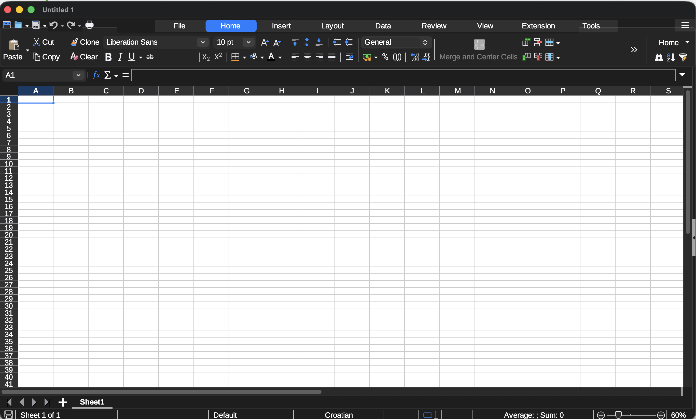
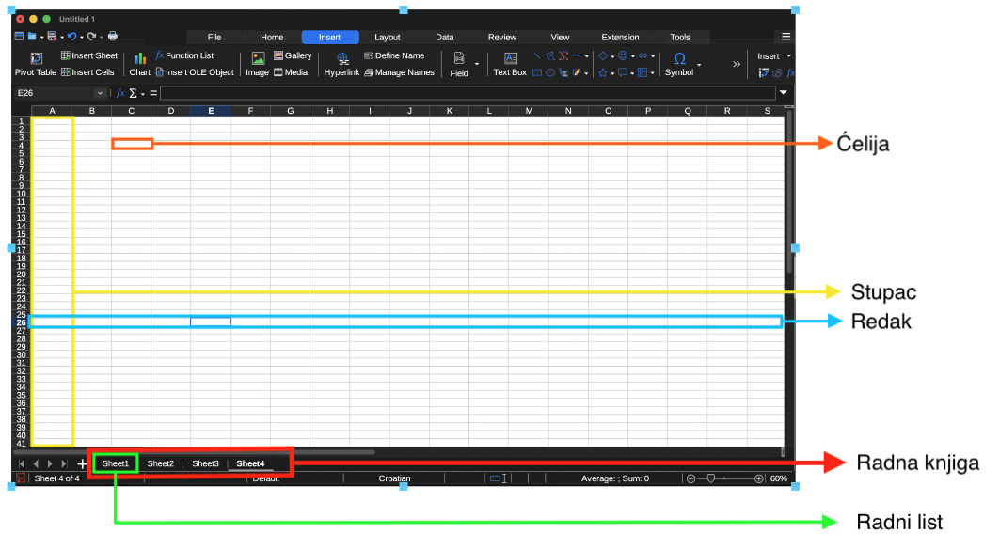

Vježba 1

Uvod u tablične kalkulatore

<strong>Profesor:</strong> doc. dr. sc. Ivan Lorencin

<strong>Asistent:</strong> Elvis Starić, mag. inf.

U uvodnoj vježbi podatke smo ručno uredili, organizirali u tablicu i iz njih izveli nekoliko zaključaka. Takav je postupak izvediv kada imamo pet vrijednosti. U ovoj ćemo vježbi isti način razmišljanja prenijeti u tablični kalkulator, gdje podatke možemo mijenjati, sortirati, filtrirati, računati i prikazivati bez ponavljanja svih koraka ručno.

Vježbu možete izvesti u bilo kojem tabličnom kalkulatoru. Skripta opisuje postupke i očekivane rezultate, a ne položaj naredbi u pojedinom programu. Nazivi naredbi i izgled sučelja mogu se razlikovati, ali su osnovni pojmovi i način rada jednaki.

Tijekom vođenog dijela koristimo jedan izmišljeni skup studentskih rezultata. Svi nazivi i podaci služe isključivo za vježbu. Na kraju ćete iste postupke primijeniti na drugi skup podataka.

# Što je tablični kalkulator?

Tablični kalkulator nije samo digitalni papir s nacrtanim redovima i stupcima. Njegova je glavna prednost u tome što povezuje **pohranu podataka** s njihovom **obradom**. Kada promijenimo ulaznu vrijednost, formule mogu automatski izračunati novi rezultat, a grafikon se može ažurirati prema promijenjenim podacima.

{fig-alt="Tablični kaklulator"}

::: {.callout-tip}
## Definicija: tablični kalkulator

**Tablični kalkulator** je program za organiziranje, pohranu, obradu i prikaz podataka u tabličnom obliku. Podaci su smješteni u ćelije organizirane u retke i stupce, a formule i ugrađene funkcije omogućuju izvođenje izračuna.
:::

Primjeri tabličnih kalkulatora su LibreOffice Calc, Microsoft Excel, Google tablice i Apple Numbers. Različiti alati koriste različite formate radnih knjiga, primjerice `.ods` ili `.xlsx`. Jednostavni tablični podaci mogu se razmjenjivati i u formatu `.csv`, koji ćemo detaljnije obraditi kasnije.

## Radna knjiga, radni list i ćelija

Kada u tabličnom kalkulatoru napravimo novu datoteku, dobivamo radnu knjigu koja može sadržavati jedan ili više radnih listova. Kartice radnih listova nalaze se pri dnu prozora.

::: {.callout-tip}
## Osnovni pojmovi

**Radna knjiga** je cijela datoteka tabličnog kalkulatora. Može sadržavati više radnih listova.

**Radni list** je jedna mreža ćelija unutar radne knjige. Listovi se mogu koristiti za odvajanje izvornih podataka, izračuna ili različitih razdoblja.

**Ćelija** je polje na sjecištu retka i stupca. Stupci su označeni slovima, a retci brojevima, pa svaka ćelija ima adresu poput `A1`, `C4` ili `F12`.
:::

{fig-alt="Komponente tabličnih kalkulator"}

Adresa `C4` znači da se ćelija nalazi u stupcu C i retku 4. Adresa nam omogućuje da u formuli kažemo iz kojih ćelija treba uzeti vrijednosti. Trenutačno odabranu ćeliju prepoznajemo po obrubu, a njezina je adresa prikazana lijevo od trake za formule.

# Preuzimanje i priprema radne knjige

## Preuzmite datoteku za vježbu

Preuzmite datoteku `vjezba-1.xlsx` s **Merlina** i otvorite je u tabličnom kalkulatoru po izboru. 
Radna knjiga sadrži dva pripremljena radna lista:

- `Rezultati`, koji ćemo koristiti u vođenom dijelu vježbe
- `Inventar`, koji ćete koristiti za samostalni zadatak.

Naziv radne knjige govori kojoj aktivnosti datoteka pripada, a naziv lista što se na njemu nalazi. Nazivi poput `Konačno`, `Novo` ili `List7` brzo postaju nejasni kada se u radnoj knjizi pojavi više listova.

## Zapis brojeva i formula

Regionalna postavka utječe na prikaz datuma, decimalni separator i znak kojim razdvajamo argumente funkcije. U hrvatskoj postavci decimalni broj obično pišemo kao `67,5`, a više argumenata funkcije odvajamo točkom sa zarezom, primjerice:

~~~text
=IF(H2>=60;"Prolaz";"Nije prolaz")
~~~

U ovoj skripti funkcije su zapisane engleskim nazivima, a argumenti su odvojeni točkom sa zarezom. Ako vaš program ne prihvati prikazanu formulu, provjerite očekuje li zarez između argumenata ili prevedeni naziv funkcije. Sama logika formule ostaje jednaka.

## Pokazni primjer: radni list `Rezultati`

Odaberite radni list `Rezultati`. Na ovom ćemo pokaznom primjeru zajedno proći uređivanje, računanje, sortiranje, filtriranje i izradu grafikona. Podaci su već uneseni u raspon `A1:G13`, prije obrade provjerit ćemo njihovu strukturu i urediti prikaz.

## Provjerite strukturu prije obrade

Nemojte odmah računati. Najprije provjerite je li tablica prenesena bez pogreške:

- prvi redak sadrži sedam različitih zaglavlja
- svaki sljedeći redak predstavlja jednog studenta
- ID oznake idu od `S01` do `S12`
- stupci `Dolasci`, `Zadatak 1` i `Zadatak 2` sadrže brojeve
- stupac `Predano` sadrži samo `Da` ili `Ne`
- nema potpuno praznog retka unutar tablice.

## Uredite prikaz

**Zadatak:** uredite tablicu tako da se zaglavlje jasno razlikuje od podataka, svi sadržaji budu čitljivi, a zaglavlje ostane vidljivo pri pomicanju po listu.

**Postupak:**

1. Podebljajte prvi redak
2. Odaberite boju pozadine koja zaglavlje jasno razlikuje od podataka
3. Prilagodite širinu stupaca tako da su zaglavlja i vrijednosti vidljivi
4. Zamrznite prvi redak odgovarajućom naredbom svojeg programa.

Zamrznuti redak ostaje vidljiv tijekom pomicanja po većoj tablici. To ne mijenja podatke, nego samo način na koji ih vidimo.

Prikaži očekivani rezultat

Tablica treba imati jasno istaknuto zaglavlje i vidljive cjelovite nazive stupaca. Pri pomicanju prema dnu lista prvi redak treba ostati vidljiv.

# Formule i funkcije

## Formula počinje znakom jednakosti

**Zadatak:** za svakog studenta izračunajte prosjek bodova iz stupaca `Zadatak 1` i `Zadatak 2`.

**Postupak:**

1. U praznu ćeliju `H1` upišite zaglavlje `Prosjek`
2. Odaberite ćeliju `H2`
3. Upišite sljedeću formulu i pritisnite Enter:

~~~text
=AVERAGE(E2:F2)
~~~

::: {.callout-tip}
## Definicije: formula, funkcija i raspon

**Formula** je izraz kojim tabličnom kalkulatoru zadajemo izračun. Počinje znakom `=`.

**Funkcija** je unaprijed definirana operacija. Funkcija `AVERAGE` računa aritmetičku sredinu brojčanih vrijednosti.

**Raspon** je skup ćelija. Zapis `E2:F2` označava sve ćelije od `E2` do `F2`, uključujući obje krajnje ćelije.
:::

Formula `=AVERAGE(E2:F2)` uzima bodove iz ćelija `E2` i `F2`, zbraja ih i dijeli s brojem brojčanih vrijednosti. Za Anu računa `(78 + 84) / 2 = 81`.

4. Ponovno odaberite `H2` i usporedite vrijednost prikazanu u ćeliji s formulom prikazanom u traci za formule.

U ćeliji vidite rezultat, a u traci za formule iznad lista formulu koja ga je proizvela. Rezultat i formula nisu isto: formula se čuva u ćeliji, a prikazana vrijednost izračunava se iz trenutačnih ulaznih podataka.

Prikaži očekivani rezultat prve formule

U ćeliji `H2` treba se pojaviti rezultat `81`, dok traka za formule treba prikazivati `=AVERAGE(E2:F2)`.

**Kopiranje formule na sve studente:**

1. Odaberite ćeliju `H2`
2. Pronađite mali kvadratić u njezinu donjem desnom kutu, odnosno **ručicu za ispunu**
3. Povucite ručicu do retka 13 ili je dvaput kliknite kako biste formulu kopirali na sve studente
4. Otvorite nekoliko ćelija u stupcu H i provjerite formule u traci za formule.

U retku 3 formula treba biti `=AVERAGE(E3:F3)`, a u retku 13 `=AVERAGE(E13:F13)`. Tablični kalkulator automatski je prilagodio reference retku u koji je formula kopirana.

Prikaži očekivane prosjeke

| Student | Prosjek |
|---|---:|
| Ana | 81 |
| Bruno | 67,5 |
| Carla | 90 |
| David | 58 |
| Ema | 74,5 |
| Filip | 89,5 |
| Gita | 49,5 |
| Hrvoje | 66,5 |
| Iva | 94 |
| Jakov | 53,5 |
| Karla | 80 |
| Luka | 80,5 |

Promijenite Anin rezultat u ćeliji `E2` s `78` na `80`. Prosjek u `H2` trebao bi se automatski promijeniti s `81` na `82`. Vratite vrijednost `E2` na `78` prije nastavka.

Ova mala izmjena pokazuje glavnu prednost formule: ne spremamo samo gotov odgovor, nego i pravilo prema kojem se odgovor izračunava.

## Prosjek cijelog raspona

Do sada smo računali prosjek dvaju zadataka za svakog studenta, odnosno prosjek vrijednosti u istom retku. Sada želimo izračunati **prosjek svih studenata za Zadatak 1**, pa u izračun uključujemo vrijednosti iz istog stupca.

**Zadatak:** izračunajte prosjek rezultata svih studenata za `Zadatak 1`.

**Postupak:**

1. U ćeliju `J1` upišite `Sažetak`
2. U ćeliju `J2` upišite `Prosjek zadatka 1`
3. U ćeliju `K2` unesite:

~~~text
=AVERAGE(E2:E13)
~~~

Znak `:` označava cijeli neprekinuti raspon od prve do posljednje navedene ćelije. Zato `E2:E13` uključuje ćelije `E2`, `E3`, `E4` i sve ostale do `E13`.

Kada bismo funkciji prosljeđivali pojedinačne ćelije, odvajali bismo ih točkom sa zarezom. Primjerice, prosjek samo prve tri vrijednosti mogli bismo zapisati kao:

~~~text
=AVERAGE(E2;E3;E4)
~~~

Budući da su sve ćelije od `E2` do `E13` susjedne, zapis raspona `E2:E13` kraći je, pregledniji i smanjuje mogućnost da neku ćeliju izostavimo.

Prikaži očekivani rezultat

Prosjek svih studenata za Zadatak 1 iznosi `73,0833...`.

## Ostali sažeci

**Zadatak:** izračunajte prosjek drugog zadatka te prebrojite brojčane, neprazne i uvjetno odabrane vrijednosti.

**Postupak:**

1. U ćelije `J3:J6` unesite sljedeće opise:

   | Ćelija | Sadržaj |
   |---|---|
   | J3 | Prosjek zadatka 2 |
   | J4 | Broj rezultata zadatka 1 |
   | J5 | Broj studenata |
   | J6 | Broj predanih radova |

2. U ćelije `K3:K6` redom unesite formule:

~~~text
=AVERAGE(F2:F13)
=COUNT(E2:E13)
=COUNTA(B2:B13)
=COUNTIF(G2:G13;"Da")
~~~

3. Označite ćelije `K2:K3` i postavite prikaz na dvije decimale.

::: {.callout-tip}
## Funkcije za računanje i brojanje

`AVERAGE` računa aritmetičku sredinu brojčanih vrijednosti u rasponu.

`COUNT` broji ćelije koje sadrže brojeve. Tekstualne i prazne ćelije ne ulaze u rezultat.

`COUNTA` broji sve ćelije koje nisu prazne, neovisno o tome sadrže li broj ili tekst.

`COUNTIF` broji ćelije koje zadovoljavaju zadani uvjet. U formuli `=COUNTIF(G2:G13;"Da")` uvjet je tekst `Da`.
:::

Prikaži očekivane rezultate sažetka

| Sažetak | Rezultat |
|---|---:|
| Prosjek zadatka 1 | 73,0833... |
| Prosjek zadatka 2 | 74,3333... |
| Broj rezultata zadatka 1 | 12 |
| Broj studenata | 12 |
| Broj predanih radova | 9 |

Rezultat prosjeka može sadržavati puno decimala. Postavljanjem prikaza na dvije decimale mijenjate **prikaz**, a ne vrijednost koju tablica čuva i koristi u daljnjim izračunima.

::: {.callout-warning}
## Prazna ćelija nije isto što i nula

Funkcija `AVERAGE` zanemaruje praznu ćeliju, ali broj `0` uključuje u prosjek. Nulu unosimo samo kada stvarno znači izmjerenu ili ostvarenu vrijednost nula. Ako rezultat nije poznat ili nije zabilježen, ne zamjenjujemo ga nulom bez opravdanog pravila.
:::

# Sortiranje podataka

Sortiranje mijenja redoslijed redaka prema vrijednostima odabranog stupca. Ne uklanja retke i ne mijenja same vrijednosti.

::: {.callout-warning title="Jedan redak mora ostati jedna cjelina"}
Vrijednosti u istom retku pripadaju istom studentu. Ako sortiramo samo jedan stupac, imena i rezultati više neće odgovarati jedni drugima. Zato pri sortiranju moramo obuhvatiti cijelu tablicu.
:::

**Zadatak:** poredajte studente od najvećeg prema najmanjem prosjeku, pri čemu svi podaci o pojedinom studentu moraju ostati u istom retku.

**Postupak:**

1. Označite raspon cijele tablice `A1:H13`
2. Pokrenite naredbu za sortiranje podataka
3. Naznačite da prvi redak sadrži zaglavlja
4. Kao ključ sortiranja odaberite stupac `Prosjek`
5. Odaberite silazni redoslijed, od najveće prema najmanjoj vrijednosti, i potvrdite sortiranje.

Prikaži provjeru rezultata

Prva tri studenta trebaju biti:

1. Iva - 94
2. Carla - 90
3. Filip - 89,5

Posljednja tri trebaju biti David, Jakov i Gita, a Gita s prosjekom 49,5 treba biti posljednja.

Provjerite jedan redak prema izvornoj tablici. Iva i dalje mora imati rezultate 95 i 93, a oznaka predaje mora ostati `Da`. Ako su se pomaknule samo vrijednosti u stupcu Prosjek, sortirali ste samo jedan stupac i narušili veze među podacima. Poništite radnju s `Ctrl + Z` ili `Cmd + Z` i ponovite sortiranje cijelog raspona.

Nakon provjere ponovno sortirajte cijelu tablicu uzlazno prema stupcu `ID`. Time vraćamo početni redoslijed od `S01` do `S12`, koji ćemo koristiti u sljedećim koracima i na grafikonu.

::: {.callout-tip}
## Definicija: sortiranje

**Sortiranje** uređuje retke prema vrijednostima jednog ili više stupaca. Uzlazni redoslijed ide od manjeg prema većem odnosno od A prema Z, a silazni od većeg prema manjem odnosno od Z prema A.
:::

# Filtriranje podataka

Sortiranjem vidimo sve retke u drugom redoslijedu. Filtriranjem privremeno prikazujemo samo retke koji zadovoljavaju odabrane uvjete.

**Zadatak:** privremeno prikažite samo retke koji zadovoljavaju zadane uvjete, bez brisanja ostalih podataka.

## Prikažite samo jednu grupu

**Postupak:**

1. Označite cijelu tablicu `A1:H13`
2. Uključite filtriranje (u zaglavljima će se pojaviti kontrole filtra)
3. Otvorite filtar u stupcu `Grupa`
4. Uklonite odabir svih vrijednosti
5. Označite samo vrijednost `A` i primijenite filtar.

Primijetite da brojevi redaka više nisu uzastopni. Redci druge grupe nisu izbrisani, samo privremeno skriveni.

Prikaži očekivani rezultat

Trebali biste vidjeti šest studenata: Anu, Carlu, Emu, Gitu, Ivu i Karlu.

## Kombinirajte više uvjeta filtra

**Postupak:**

1. Zadržite postojeći uvjet `Grupa = A`
2. Otvorite mogućnosti filtra za stupac `Zadatak 1`
3. Dodajte brojčani uvjet `veće od ili jednako 70`
4. Primijenite filtar.

Ovisno o programu, brojčani uvjet može se postaviti izravno u kontroli stupca ili u posebnom prozoru za filtriranje.

Prikaži očekivani rezultat

Trebali biste vidjeti Anu, Carlu, Emu, Ivu i Karlu. Gita pripada grupi A, ali ima 47 bodova iz prvog zadatka, pa ne zadovoljava drugi uvjet.

Ova dva filtra povezana su operatorom `AND`: redak mora zadovoljiti oba uvjeta kako bi ostao prikazan.

**Povratak na cijelu tablicu:**

1. Uklonite uvjete postavljene na stupcima `Grupa` i `Zadatak 1`
2. Provjerite prikazuje li tablica ponovno svih 12 studenata.

::: {.callout-tip}
## Definicija: filtriranje

**Filtriranje** privremeno prikazuje samo retke koji zadovoljavaju zadane uvjete. Ostali retci ostaju u tablici, ali su skriveni dok je filtar aktivan.
:::

::: {.callout-note}
## Filtriranje ne mijenja izvorne podatke

Programi mogu nuditi više vrsta filtara i njihove se kontrole mogu razlikovati. U svakom slučaju provjeravamo uvjet i dobiveni skup redaka. Filtriranje ne prepisuje vrijednosti i ne briše retke uklanjanjem filtra ponovno prikazujemo cijelu tablicu.
:::

# Grafički prikaz rezultata

Grafikon izrađujemo zato što imamo pitanje na koje vizualni prikaz može jasno odgovoriti. Želimo usporediti rezultate dvaju zadataka za svakog studenta.

**Zadatak:** izradite grafikon na kojem se za svakog studenta mogu usporediti bodovi iz prvog i drugog zadatka.

**Postupak:**

1. Pokrenite izradu novog grafikona
2. Kao oznake kategorija postavite imena studenata iz raspona `B2:B13`
3. Kao prvi niz podataka postavite vrijednosti `Zadatak 1` iz raspona `E2:E13`
4. Kao drugi niz podataka postavite vrijednosti `Zadatak 2` iz raspona `F2:F13`
5. Odaberite stupčasti grafikon i postavite naslov `Rezultati zadataka po studentu`
6. Provjerite jesu li nazivi nizova preuzeti iz zaglavlja `E1` i `F1`.

Neki programi omogućuju da raspone odaberete prije umetanja grafikona, a u drugima ih je jednostavnije zadati tijekom uređivanja grafikona. Važno je da imena studenata postanu oznake kategorija, a rezultati dvaju zadataka dva odvojena niza podataka.

Prikaži očekivani rezultat i provjeru

Grafikon treba zadovoljiti sljedeće uvjete:

- naslov govori što prikazujemo
- uz svakog studenta nalaze se dva stupca
- legenda razlikuje `Zadatak 1` i `Zadatak 2`
- brojčana os ima smislen raspon i počinje od nule
- grafikon ne sadrži stupce `Dolasci` ili `Prosjek`, jer ih nismo uključili u pitanje.

**Provjera automatskog ažuriranja:**

1. Promijenite jednu vrijednost u tablici
2. Provjerite je li se pripadajući stupac na grafikonu ažurirao
3. Vratite izvornu vrijednost.

::: {.callout-tip}
## Zašto stupčasti grafikon?

Studenti su kategorije koje uspoređujemo, a bodovi su brojčane vrijednosti. Stupčasti grafikon omogućuje usporedbu visina stupaca među studentima i između dvaju zadataka.

Linijski grafikon ovdje bi mogao stvarati dojam neprekinutog procesa između susjednih studenata. Takva veza ne postoji, pa je stupčasti prikaz primjereniji.
:::

# IF, AND i OR

Formule ne moraju služiti samo računanju brojeva. Mogu provjeravati zadovoljavaju li podaci određeno pravilo i na temelju rezultata automatski ispisati oznaku, upozorenje ili odluku. Primjerice, možemo provjeriti je li student ostvario dovoljan broj bodova ili treba li neki redak dodatno pregledati.

Takve provjere temelje se na **logičkim izrazima**. Logički izraz može imati samo jedan od dva rezultata:

- `TRUE` – uvjet je ispunjen
- `FALSE` – uvjet nije ispunjen.

Primjer `H2>=60` provjerava je li vrijednost u ćeliji `H2` veća ili jednaka 60. Ako se u `H2` nalazi 81, rezultat izraza je `TRUE`. Izraz `C2="A"` provjerava pripada li student u tom retku grupi A.

::: {.callout-tip}
## Operatori usporedbe

| Operator | Značenje | Primjer |
|---|---|---|
| `=` | jednako | `C2="A"` |
| `<>` | nije jednako | `C2<>"A"` |
| `>` | veće od | `H2>60` |
| `>=` | veće od ili jednako | `H2>=60` |
| `<` | manje od | `D2<3` |
| `<=` | manje od ili jednako | `D2<=3` |

Kod usporedbe teksta vrijednost pišemo unutar navodnika. Brojčane vrijednosti pišemo bez navodnika.
:::

## Funkcija IF

Funkcija `IF` provjerava jedan logički uvjet i vraća različit rezultat ovisno o tome je li uvjet istinit ili neistinit. Opći oblik je:

~~~text
=IF(uvjet; rezultat_ako_je_TRUE; rezultat_ako_je_FALSE)
~~~

Funkcija ima tri dijela:

1. Uvjet koji provjeravamo
2. Rezultat koji želimo dobiti kada je uvjet ispunjen
3. Rezultat koji želimo dobiti kada uvjet nije ispunjen.

**Zadatak:** označite je li student ostvario prosjek od najmanje 60 bodova.

**Postupak:**

1. U ćeliju `I1` upišite `Status`
2. U ćeliju `I2` unesite:

~~~text
=IF(H2>=60;"Prolaz";"Nije prolaz")
~~~

3. Kopirajte formulu do retka 13.

U ovoj formuli:

- `H2>=60` predstavlja uvjet
- `"Prolaz"` je rezultat kada je uvjet `TRUE`
- `"Nije prolaz"` je rezultat kada je uvjet `FALSE`.

Ana u ćeliji `H2` ima prosjek 81. Budući da je 81 veće ili jednako 60, uvjet je istinit i funkcija ispisuje `Prolaz`. Kada formula dođe do Gitina retka, prosjek 49,5 ne zadovoljava uvjet pa funkcija ispisuje `Nije prolaz`.

Prikaži provjeru

Status `Nije prolaz` trebaju imati David, Gita i Jakov. Ostali trebaju imati `Prolaz`.

## Funkcija AND

Ponekad jedan uvjet nije dovoljan. Funkcija `AND` povezuje više uvjeta i vraća `TRUE` samo kada su **svi** navedeni uvjeti ispunjeni, a ako je **jedan ili više** uvjeta neispunjen rezultata je `FALSE`. Opći oblik je:

~~~text
=AND(uvjet1; uvjet2; uvjet3)
~~~

**Zadatak:** provjerite ima li student najmanje tri dolaska **i** najmanje 50 bodova iz svakog zadatka.

**Postupak:**

1. Odaberite ćeliju `I2` i zamijenite prethodnu formulu
2. Unesite:

~~~text
=IF(AND(D2>=3;E2>=50;F2>=50);"Uvjet zadovoljen";"Uvjet nije zadovoljen")
~~~

3. Kopirajte formulu do retka 13.

Funkcija `AND` u ovom primjeru provjerava tri uvjeta:

1. `D2>=3` – student ima najmanje tri dolaska
2. `E2>=50` – iz prvog zadatka ima najmanje 50 bodova
3. `F2>=50` – iz drugog zadatka ima najmanje 50 bodova.

Rezultat funkcije `AND` postaje uvjet funkcije `IF`. Ako su sva tri dijela istinita, `IF` ispisuje `Uvjet zadovoljen`. Ako barem jedan nije istinit, ispisuje `Uvjet nije zadovoljen`.

Primjerice, Ana zadovoljava sva tri uvjeta. Jakov ima dovoljno dolazaka i bodova iz prvog zadatka, ali iz drugog zadatka ima 49 bodova. Jedan neistinit uvjet dovoljan je da cijeli `AND` vrati `FALSE`.

Prikaži provjeru

Uvjet ne zadovoljavaju Gita, koja ima samo dva dolaska i 47 bodova iz prvog zadatka, te Jakov, koji ima 49 bodova iz drugog zadatka. Ostali ga zadovoljavaju.

## Funkcija OR

Funkcija `OR` također povezuje više uvjeta, ali vraća `TRUE` kada je ispunjen **barem jedan** od njih, a `FALSE` samo kada **nijedan** navedeni uvjet nije ispunjen. Opći oblik je:

~~~text
=OR(uvjet1; uvjet2)
~~~

**Zadatak:** označite retke koje treba dodatno provjeriti jer student ima manje od tri dolaska **ili** rad nije predan.

**Postupak:**

1. Odaberite ćeliju `I2` i zamijenite prethodnu formulu
2. Unesite:

~~~text
=IF(OR(D2<3;G2="Ne");"Provjeriti";"U redu")
~~~

3. Kopirajte formulu do retka 13.

Funkcija `OR` ovdje provjerava:

1. `D2<3` – student ima manje od tri dolaska
2. `G2="Ne"` – rad nije predan.

Ako je barem jedan od tih uvjeta istinit, funkcija `IF` ispisuje `Provjeriti`. Samo kada student ima najmanje tri dolaska i predan rad, oba uvjeta unutar `OR` bit će neistinita pa će rezultat biti `U redu`.

David ima tri dolaska, pa prvi uvjet nije ispunjen, ali rad nije predao. Drugi uvjet zato je dovoljan da `OR` vrati `TRUE`. Gita ima manje od tri dolaska i nije predala rad, pa su kod nje ispunjena oba uvjeta.

Prikaži provjeru

Oznaku `Provjeriti` trebaju imati David, Gita i Jakov. David i Jakov označeni su zbog vrijednosti `Ne` u stupcu Predano, a Gita zadovoljava oba razloga za provjeru.

::: {.callout-note}
## Ako formula javlja pogrešku

Provjerite počinje li znakom `=`, jesu li svi tekstovi u ravnim navodnicima te jesu li zatvorene sve zagrade. Ako dokument nije postavljen na Hrvatsku, možda umjesto točke sa zarezom očekuje zarez između argumenata.
:::

# Samostalni zadatak: inventar

Otvorite radni list `Inventar` u preuzetoj datoteci. Podaci o proizvodima već su uneseni, na njima samostalno primijenite postupke iz vođenog dijela vježbe.

Svaki rezultat ostavite vidljiv u radnom listu. Novi zadatak ne smije izbrisati ili zamijeniti rezultat prethodnog zadatka.

## Zadatak 1 - Priprema tablice

1. Uredite zaglavlje tako da se jasno razlikuje od podataka
2. Prilagodite širine stupaca i zamrznite prvi redak
3. Stupac `Jedinična cijena` oblikujte kao valutu u eurima
4. Provjerite je li svaki proizvod u jednom retku te jesu li količina i cijena prepoznate kao brojevi.

## Zadatak 2 - Izračun vrijednosti zalihe

1. Dodajte novi stupac `Vrijednost zalihe`
2. Za svaki proizvod izračunajte ukupnu vrijednost svih primjeraka na zalihi
3. Rezultate prikažite kao iznose u eurima.

## Zadatak 3 - Prosjek i brojanje

U odvojenom području radnog lista, uz jasne oznake, prikažite:

1. Prosječnu jediničnu cijenu svih proizvoda
2. Broj brojčanih vrijednosti u stupcu Količina
3. Broj nepraznih naziva proizvoda.

## Zadatak 4 - Sortiranje i filtriranje

1. Sortirajte cijelu tablicu uzlazno prema količini
2. U odvojenom području radnog lista zabilježite prva tri proizvoda nakon sortiranja
3. Prikažite samo proizvode koji pripadaju kategoriji `Pisaći pribor` i imaju količinu manju od 15
4. U odvojenom području radnog lista zabilježite proizvode koji su ostali prikazani
5. Ponovno prikažite sve proizvode.

## Zadatak 5 - Grafikon

1. Izradite grafikon koji uspoređuje količine proizvoda na zalihi
2. Naslov grafikona promijenite u `Količina proizvoda na zalihi`.

## Zadatak 6 - Automatska oznaka

1. Dodajte stupac `Status zalihe`
2. Za proizvode čija je količina manja od 10 prikažite oznaku `Naručiti`, a za ostale `Dovoljno`
3. Dodajte zaseban stupac `Prioritet nabave`
4. U njemu proizvodima iz kategorije `Elektronika` s količinom manjom od 10 prikažite oznaku `Prioritet`, a svim ostalima `Redovno`.

# Rješenja samostalnog zadatka

## Rješenje zadatka 2

U ćeliju `E2` upisujemo:

~~~text
=C2*D2
~~~

Nakon kopiranja formule očekivane vrijednosti su:

| Proizvod | Vrijednost zalihe |
|---|---:|
| Bilježnica A5 | 45,00 € |
| Kemijska plava | 8,40 € |
| Olovka HB | 20,00 € |
| Mapa A4 | 17,00 € |
| USB 32 GB | 76,50 € |
| Kalkulator | 56,00 € |
| Flomasteri | 57,60 € |
| Papir A4 | 138,00 € |

## Rješenje zadatka 3

Ako su podaci u retcima 2 do 9, formule su:

~~~text
=AVERAGE(D2:D9)
=COUNT(C2:C9)
=COUNTA(A2:A9)
~~~

Prikaži rezultate

- prosječna jedinična cijena: `5,2625 €`, odnosno `5,26 €` prikazano na dvije decimale
- broj brojčanih vrijednosti u stupcu Količina: `8`
- broj nepraznih naziva proizvoda: `8`.

## Rješenje zadatka 4

Nakon uzlaznog sortiranja prema količini prva tri proizvoda trebaju biti:

1. Kalkulator - 4
2. Mapa A4 - 5
3. Kemijska plava - 7.

Nakon filtriranja kategorije `Pisaći pribor` i količine manje od 15 trebaju ostati:

| Proizvod | Količina |
|---|---:|
| Kemijska plava | 7 |
| Flomasteri | 12 |

## Rješenje zadatka 5

Grafikon treba imati osam stupaca, po jedan za svaki proizvod. Najviši stupac treba pripadati proizvodu `Olovka HB` s količinom 25, a najniži proizvodu `Kalkulator` s količinom 4. Brojčana os treba početi od nule.

## Rješenje zadatka 6

U ćeliju `F1` upisujemo `Status zalihe`, a u `F2`:

~~~text
=IF(C2<10;"Naručiti";"Dovoljno")
~~~

Formulu kopiramo do posljednjeg proizvoda. Oznaku `Naručiti` trebaju dobiti Kemijska plava, Mapa A4, USB 32 GB i Kalkulator.

U ćeliju `G1` upisujemo `Prioritet nabave`, a u `G2`:

~~~text
=IF(AND(B2="Elektronika";C2<10);"Prioritet";"Redovno")
~~~

Formulu kopiramo do posljednjeg proizvoda. Oznaku `Prioritet` trebaju dobiti USB 32 GB i Kalkulator. Oba stupca ostaju u radnom listu kako bi se oba rezultata mogla provjeriti.

